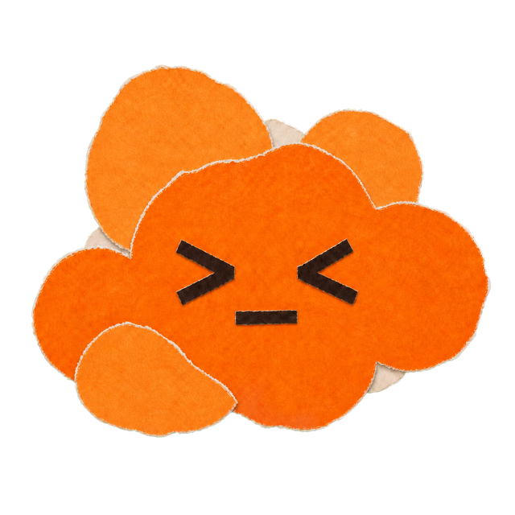

<p align="center">
  
</p>

<h1 align="center">CoPets</h1>

<p align="center">
  <strong>A desktop pet for your selected Codex task.</strong>
</p>

<p align="center">
  <a href="README.md">简体中文</a> · English
</p>

CoPets is an independent open-source macOS companion for Codex App. It presents local state from
the selected task as pet animation and compact bubbles. It does not proxy model traffic, modify the
Codex UI, or represent OpenAI.

## Install

Requires macOS 11+ and Codex App.

1. Download the DMG and `.sha256` file from the
   [`v0.2.1` release](https://github.com/ReiSuzunami/CoPets/releases/tag/v0.2.1).
2. Keep both files together and verify them:

   ```bash
   shasum -a 256 -c CoPets-v0.2.1-macos-universal.dmg.sha256
   ```

3. Open the DMG and double-click **Install CoPets** to install or upgrade.

> `v0.2.1` is a development-signed, unnotarized testing prerelease. Gatekeeper may block it; only
> bypass Gatekeeper from **System Settings → Privacy & Security** after the checksum matches.

## Use

1. Open Codex App and select a local task.
2. Open CoPets. Settings opens automatically when no valid pet is installed.
3. Import a Pet Creator-compatible folder, `pet.json`, or ZIP. No pet is installed automatically;
   the source checkout includes a [Sunflower example](examples/pets/sunflower).
4. Close Settings. The pet follows the selected task.

The experimental bridge is opt-in in Settings and depends on private, version-sensitive local
interfaces. Read the [user guide](docs/user-guide.md) and recheck compatibility after a Codex App
update.

## Build from source

```bash
npm ci
npm run codesign:setup
npm run build:macos:signed -- --bundles app
```

Output: `src-tauri/target/release/bundle/macos/CoPets.app`.

See the [user guide](docs/user-guide.md) for installation, pet management, and troubleshooting.
Asset licensing: [ASSET_LICENSES.md](ASSET_LICENSES.md).

[MIT](LICENSE) © 2026 CoPets contributors.
