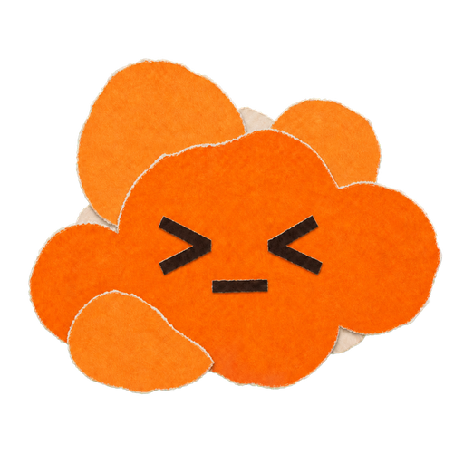

<p align="center">
  
</p>

<h1 align="center">CoPets</h1>

<p align="center">
  <strong>Make a running Codex task visible at a glance.</strong>
</p>

<p align="center">
  A small, local-first macOS companion for an already-running Codex App.
</p>

> [!IMPORTANT]
> This is an early-stage, independent open-source project—not an official OpenAI product and not endorsed by OpenAI. Attachment, task selection, and interactive controls rely on private, unversioned local Codex interfaces and may require re-verification after a Codex App update.

CoPets gives long-running work a quiet presence on your desktop. It follows the task selected in Codex, turns bounded lifecycle evidence into pet animation, and keeps background task state isolated in an independent always-on-top window.

It does not proxy model traffic, modify the Codex UI, inject into its WebView, or use Accessibility to deliver messages.

## What CoPets does

### Follow one task, honestly

The task selected in Codex owns the visible pet, animation, context bubbles, and controls. Background work stays in its own per-task state and cannot take over the foreground experience. Unknown or changed private schemas degrade to unavailable or disconnected behavior instead of fabricated success.

### Let the pet carry the personality

Load official V1/V2 pet packages and existing Pet Creator exports. Import a folder, selected `pet.json`, or ZIP from Settings, then preview, replace, reveal, select, or remove it without invoking an Agent or manually editing the pets directory.

CoPets can prefer an optional native 2x–4x Retina atlas while preserving the official package shape and fallback asset.

### Keep context compact

The pet can show up to two bounded question or progress bubbles with safe GFM Markdown and visible-prefix truncation. It does not become a transcript viewer: full prompts, full answers, hidden reasoning, tool arguments, and command output stay out of the UI.

### Keep actions explicit

Approvals, answers, active-turn steering, and stop target only the exact selected task's live owner. Controls disappear when CoPets cannot prove that authority. Steering exists only during a live turn and never creates a new one.

## Project status

| Area | Status | Scope |
| --- | --- | --- |
| Pet packages and Retina renderer | Implemented | Official V1/V2 packages with a 1x fallback plus optional native 2x–4x CoPets atlas |
| Window, animation, and bubbles | Implemented | Current macOS desktop build with automated coverage |
| Settings and onboarding | Implemented | First-run help plus validated pet import, preview, replacement, removal, selection, reveal, rescan, and window reset |
| Per-task lifecycle and background isolation | Implemented | One Codex-selected task drives the visible pet |
| Codex attachment and selected-task tracking | Experimental | Depends on private, unversioned local interfaces |
| Approvals, answers, steering, and stop | Experimental | Revalidated against the exact selected task before dispatch |

Unknown or changed private schemas degrade to unavailable or disconnected behavior instead of fabricating task state or control success. See the [feature catalog](docs/features/catalog.md) for current coverage and limits.

## Quick start

The private `v0.1.0` prerelease is available to authenticated repository collaborators. It is a
universal macOS DMG with a development signature and is not notarized; it is intended for trusted
testing, not public distribution.

### Requirements

- macOS 11 or newer for the prerelease DMG
- Codex App for task observation; it may start before or after CoPets

### Install the private prerelease

Download the DMG and checksum from the
[`v0.1.0` release](https://github.com/ReiSuzunami/CoPets/releases/tag/v0.1.0), then verify:

```bash
shasum -a 256 -c CoPets-v0.1.0-macos-universal.dmg.sha256
```

Open the DMG and double-click **Install CoPets**. The installer validates its embedded app, safely
replaces a recognized older version through same-directory staging, and refuses symbolic links or
unrecognized same-name targets. After installation it ejects the image and can move the downloaded
DMG to Trash. Reopen the DMG and choose **Uninstall Existing…** to move the app to Trash without
deleting `${CODEX_HOME:-~/.codex}/pets`.

Because this private build is development-signed and not notarized, Gatekeeper may require the
standard Finder **Open** confirmation on first launch.

### Run in development

Source development additionally requires Node.js 20 or newer and a Rust toolchain.

```bash
npm install
npm run tauri dev
```

For a locally signed development app:

```bash
npm run codesign:setup
npm run build:macos:signed -- --bundles app
```

The bundle is written to:

```text
src-tauri/target/release/bundle/macos/CoPets.app
```

Public distribution still requires an appropriate Developer ID identity and notarization; the
generated local identity and the `v0.1.0` prerelease are for trusted development testing only. See
the [user guide](docs/user-guide.md) for the complete install, update, removal, and source-build
flows.

## Bring your own pet

CoPets discovers packages from:

```text
${CODEX_HOME:-~/.codex}/pets/<id>/pet.json
```

For normal use, hover the pet, open its status menu, and choose Settings. You can import a Pet Creator package as a folder, its `pet.json`, or a ZIP. The source is not moved or edited; installation uses a staged copy, and failed validation leaves the current package unchanged.

For a ready-to-import reference package, use the smooth Retina [Sunflower example](examples/pets/sunflower). It includes the official-compatible 1x atlas and CoPets' optional native 2x atlas.

### Compatibility

CoPets preserves the official package path and fields used by Codex and Pet Creator. A package may add one optional high-resolution asset:

```json
{
  "id": "example-pet",
  "displayName": "Example Pet",
  "description": "A desktop companion",
  "spriteVersionNumber": 2,
  "spritesheetPath": "spritesheet.webp",
  "sidecarSpritesheetPath": "spritesheet-native-2x.webp"
}
```

`spritesheetPath` remains official-compatible. `sidecarSpritesheetPath` is CoPets' legacy-named extension field for integer-scaled 2x–4x rendering and is ignored by official consumers. The key remains unchanged for package compatibility. See the [pet package contract](docs/protocol/pet-package.md) for geometry, validation, and atlas generation.

## Privacy and trust boundary

CoPets is deliberately narrower than a transcript viewer:

- Reads only the newest 2 MB of active session logs.
- Keeps bounded, in-memory previews for the selected task.
- Does not persist conversation previews.
- Does not expose raw task/request IDs or private IPC snapshots to the WebView.
- Does not display full prompts, full answers, hidden reasoning, tool arguments, or command output.
- Does not create a new turn after completion; steering exists only during a live turn.

The full data-flow and trust boundary are documented in the [runtime architecture](docs/architecture/runtime.md).

## Develop and verify

The atlas test additionally requires Python 3.13 and the locked development dependency:

```bash
python3 -m pip install --only-binary=:all: --require-hashes -r requirements-dev.txt
```

Run the required local checks:

```bash
npm run check:all
```

Architecture at a glance:

```text
Codex local signals
  -> Rust observation adapters and per-task reducer
  -> bounded Tauri events
  -> Svelte presentation and PixiJS pet renderer
```

Current stack: Rust, Tauri 2, Svelte 5, and PixiJS 8.

## Read more

| If you want to… | Start here |
| --- | --- |
| Run CoPets or manage pets | [User guide](docs/user-guide.md) |
| Check current support and limits | [Feature catalog](docs/features/catalog.md) |
| Understand data flow and privacy | [Runtime architecture](docs/architecture/runtime.md) |
| Author a compatible package | [Pet package contract](docs/protocol/pet-package.md) |
| Change or release the project | [Updating and release rules](docs/maintenance/updating.md) |
| See planned work | [Roadmap](docs/roadmap.md) |
| Navigate all documentation | [Documentation map](docs/README.md) |
| Review shipped changes | [Changelog](CHANGELOG.md) |

Research under [`docs/research`](docs/research) is dated evidence about private Codex surfaces, not a permanent compatibility guarantee. Snapshots created before the rename may refer to CoPets by its former development name, DeskPal.

## Contributing

Read [CONTRIBUTING.md](CONTRIBUTING.md) before changing observation, routing, privacy, or package behavior. Keep changes narrow, update the canonical document owner, and run the required checks.

## License

[MIT](LICENSE) © 2026 CoPets contributors.
