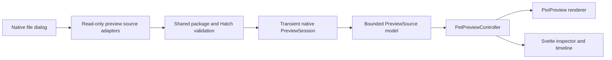

# Pet Preview Studio

> Status: Proposed
> Owns: Developer previewer scope, UX contract, source adapters, diagnostic model, trust boundary, and acceptance gates
> Update when: Previewer scope, window ownership, supported inputs, diagnostic behavior, or delivery phase changes
> Last verified: 2026-07-24

## Summary

Pet Preview Studio is a read-only development surface for CoPets maintainers and Pet authors. It opens a validated Pet package or a Hatch Pet run, plays every supported animation deterministically, compares official and Retina variants, and exposes geometry defects before assets are installed.

It is a separate developer window, not an extension of ordinary settings. It never observes Codex, installs a package, changes the selected pet, edits source files, or invokes generation scripts.

## Problem

Current import preview validates a package and temporarily renders its selected atlas, but it does not expose animation selection, frame stepping, timing, variant comparison, or geometry overlays. Offline contact sheets and videos help, but they do not reveal every transform introduced between a generated strip, extracted frames, the official atlas, and a native Retina atlas.

The Sunflower Working loop exposed the concrete failure: source frames kept the plant stationary while per-frame packing rescaled the whole sprite. A useful previewer must compare runtime geometry, not only source artwork.

## Users and primary task

Primary users:

- CoPets maintainers validating renderer and packaging changes.
- Pet authors iterating on Codex-compatible V1/V2 packages and CoPets Retina variants.

Primary action:

> Open one source, select one animation, and determine whether its frames render with the intended timing, scale, position, transparency, and variant parity.

Users arrive focused and suspicious of subtle motion defects. The interface should optimize inspection speed, deterministic replay, and confidence rather than presentation or delight.

## Design direction

Color strategy is restrained. Pet artwork supplies most color; tool chrome reuses the neutral OKLCH tokens, system font stack, focus treatment, and compact control vocabulary in [`ui/style.css`](../../ui/style.css).

Scene sentence: a Pet author sits at a Mac beside Codex and an image editor, repeatedly scrubbing six to eight animation frames under mixed ambient light while looking for one-pixel drift.

Reference qualities:

- Xcode Preview Canvas: source-adjacent inspection without changing runtime state.
- Figma prototype inspector: clear separation between canvas, controls, and properties.
- Aseprite timeline: fast state/frame navigation and legible current-frame position.

These are interaction references, not visual templates. Preview Studio remains recognizably CoPets.

## Scope

P0 is a production-ready developer surface, not a throwaway prototype. It covers one resizable macOS window, one active source, all supported animation rows, deterministic playback, atlas-variant comparison, diagnostic overlays, and validation errors.

P0 includes:

- Open package folder, selected `pet.json`, or ZIP through existing package validation.
- Open a Hatch run directory in read-only mode.
- Switch all nine core atlas rows; V2 packages retain the same core rows and may expose their look-direction rows separately.
- Play, pause, scrub, step, and override preview FPS.
- Compare the official-compatible atlas and the package's one optional native 2x-4x sidecar at equal logical size; Hatch runs may expose multiple generated native variants.
- Switch transparent checkerboard, light, dark, and solid diagnostic backgrounds.
- Toggle cell, alpha bounds, bottom-center anchor, onion skin, and frame difference overlays.
- Show bounded validation and geometry diagnostics.
- Cancel stale loads and release superseded textures.

P1 may add:

- User-pinned stationary regions with measured translation and scale drift.
- Side-by-side synchronized variant playback.
- Provenance, contact-sheet, and sanitized diagnostic report export.
- Persisted non-sensitive inspector preferences.
- A separately signed author utility if Preview Studio needs distribution outside development builds.

Non-goals:

- Pixel, timing, manifest, or spritesheet editing.
- Image generation, frame extraction, atlas composition, or automatic repair.
- Package installation, replacement, removal, activation, or publishing.
- Codex lifecycle, conversation, approval, steering, or stop integration.
- Arbitrary spritesheets outside the documented V1/V2 or Hatch run contracts.
- Remote sources, cloud storage, collaboration, or telemetry.

## Entry and lifecycle

P0 ships only in development builds. A debug-only menu item opens a Tauri window labeled `preview`. Release settings and the normal pet window expose no Preview Studio entry.

The window owns one transient preview session. Closing it destroys its Pixi application, textures, file handles, opaque source token, and diagnostics. Reopening starts empty. P0 does not persist the source path, selected package, selected state, or window contents.

[`ui/App.svelte`](../../ui/App.svelte) must route `pet`, `settings`, and `preview` explicitly. Unknown labels fail closed instead of falling through to `PetWindow`.

## Supported sources

### Pet package

Accept the same folder, manifest-file, and ZIP inputs as [`PetPackageManager::preview_import`](../../src-tauri/src/pet.rs). Reuse shared manifest, media, size, path, symlink, ZIP, geometry, and render-scale validation owned by the [Pet package contract](../protocol/pet-package.md).

The preview adapter needs a preview-specific multi-variant result. It loads `spritesheetPath` and, when present, the one `sidecarSpritesheetPath` independently instead of calling the current single-sheet `preview_import` result. Existing import preview behavior and `LoadedPet` remain unchanged.

Loading is read-only. It does not stage, copy, install, activate, or change catalog selection.

### Hatch run directory

A run adapter recognizes:

```text
<run>/
  pet_request.json
  decoded/<state>.png
  frames/<state>/<frame>.png
  final/spritesheet.webp                 # optional
  final/spritesheet-native-<scale>x.webp # optional
  final/native-<scale>x-provenance.json  # optional
  qa/review.json                         # optional
```

Allowed core state IDs and frame order are fixed:

| State | Frames |
| --- | ---: |
| `idle` | 6 |
| `running-right` | 8 |
| `running-left` | 8 |
| `waving` | 4 |
| `jumping` | 5 |
| `failed` | 8 |
| `waiting` | 6 |
| `running` | 6 |
| `review` | 6 |

Frame files use zero-padded numeric names from `00.png` through the expected final index. Decoded row strips use `<state>.png`. Unknown states, duplicate numeric indices, non-PNG frame/strip media, missing indices inside an otherwise present stage, or a `pet_request.json` row definition that disagrees with this table produce diagnostics and make that stage unavailable.

Implementation constants bound individual encoded images, decoded pixel count, regular-file count, and aggregate bytes before P0 acceptance. Atlas limits reuse the package contract; Hatch-specific limits live in the native preview module with boundary tests.

The adapter reports each available pipeline stage separately:

- `decoded`: generated row-strip source.
- `official`: extracted/composed 1x runtime atlas or numbered frames, when generated.
- `native-Nx`: native atlas and provenance when present.

A partial run may open. Missing stages remain unavailable and produce bounded diagnostics. Native PNG/WebP atlases and fallback atlases are optional derived outputs; their presence depends on which generation command has run. Preview Studio never executes `finalize_pet_run.py`, [`build_native_atlas.py`](../../scripts/build_native_atlas.py), or any file contained by the selected directory.

The adapter reads only the selected canonical root and the known relative paths above. Symlinks, parent escapes, special files, unsupported media, unreasonable image dimensions, and excessive aggregate bytes fail closed.

## Information architecture

```text
┌──────────────────────────────────────────────────────────────────────┐
│ Open Package  Open Hatch Run  Source identity  Validation  Reload   │
├──────────────┬──────────────────────────────────────┬────────────────┤
│ States       │ Preview stage                        │ Inspector      │
│              │                                      │                │
│ Idle         │        logical 192 × 208 cell        │ Variant        │
│ Run Right    │                                      │ Playback       │
│ Run Left     │             rendered pet             │ Background     │
│ Wave         │                                      │ Overlays       │
│ Jump         │                                      │ Geometry       │
│ Failed       │                                      │ Diagnostics    │
│ Waiting      │                                      │                │
│ Working      │                                      │                │
│ Review       │                                      │                │
├──────────────┴──────────────────────────────────────┴────────────────┤
│  ◀  ▶  Play/Pause   frame 3 / 6   timeline   timing   zoom          │
└──────────────────────────────────────────────────────────────────────┘
```

Hierarchy:

1. Preview stage receives the largest area and remains visually quiet.
2. State list and timeline answer where the user is.
3. Inspector answers how the frame is being rendered.
4. Diagnostics explain defects without covering the artwork.

The inspector uses grouped controls and disclosure, not a grid of decorative cards. The window supports compact desktop density; it is not responsive mobile UI. At narrow supported widths, the inspector collapses to a drawer while state list and timeline remain available.

## Interaction model

### Source loading

1. User chooses `Open Package` or `Open Hatch Run`.
2. Native dialog returns a transient selected path to native validation.
3. Existing preview stays visible while the new source validates and decodes.
4. Successful load atomically replaces the session.
5. Failed or cancelled load leaves the prior session untouched.

Reload uses an opaque native session token. Full canonical paths are never returned as preview metadata or persisted.

### Playback

- Preview opens paused on frame zero when reduced motion is enabled; otherwise it opens paused on the first frame of `idle`.
- Play loops the selected animation. Terminal runtime semantics are not applied; every row loops for inspection.
- Frame stepping wraps only when the user enables `Loop stepping`; default stepping clamps at first and last frame.
- FPS override changes preview cadence only. It never writes timing data.
- Selecting a new state resets to frame zero and preserves play/pause mode.
- Scrubbing is deterministic and does not depend on the production Pixi ticker.

### Variant and zoom

Atlas variant and view zoom are separate controls:

- Variant selects `official-1x`, `native-2x`, `native-3x`, `native-4x`, or an available Hatch stage.
- Every atlas variant renders at the same logical 192 × 208 cell size so geometry can be compared directly.
- Zoom changes only the inspection canvas. It ranges from 25% to 800% and defaults to Fit.
- Switching variant keeps state, frame, overlay settings, and logical zoom where possible.

### Keyboard

| Shortcut | Action |
| --- | --- |
| `Command-O` | Open Pet package |
| `Command-Shift-O` | Open Hatch run |
| `Space` | Play or pause |
| `Left` / `Right` | Previous or next frame |
| `Shift-Left` / `Shift-Right` | Previous or next state |
| `Home` / `End` | First or last frame |
| `1` / `2` / `3` / `4` | Select available atlas scale |
| `-` / `+` | Decrease or increase view zoom |
| `0` | Fit preview |
| `B` | Toggle alpha bounds |
| `C` | Toggle cell bounds |
| `A` | Toggle anchor |
| `O` | Toggle onion skin |
| `D` | Toggle frame difference |
| `R` | Reload source |

Shortcuts do not fire while a text or numeric field owns focus. Every shortcut has a visible control and accessible label.

## Diagnostic model

Diagnostics have severity `error`, `warning`, or `info`, a stable code, a bounded message, and optional state/frame/variant coordinates. They never include source paths or raw file contents. The native boundary maps filesystem, archive, decoder, and parser failures to this allowlisted diagnostic vocabulary; raw error strings never cross into the WebView.

P0 diagnostics:

- Manifest, media, size, atlas geometry, version, and render-scale validation.
- Missing, extra, empty, or unreadable states and frames.
- Nontransparent pixels touching a cell edge.
- Alpha bounds, center, width, and height per frame.
- Frame-count mismatch against [`ANIMATIONS`](../../ui/lib/pet.js).
- Logical alignment mismatch between official and native variants.
- Per-frame placement scale mismatch when provenance supplies placement records.
- Missing or inconsistent native provenance.
- Chroma-adjacent pixels and warnings already reported by Hatch QA.

Bounds or scale variance is evidence, not a defect by itself; many animations intentionally squash, stretch, jump, or travel. Automatic diagnostics must describe measured change and avoid semantic claims such as “the stem moved.” Onion skin and difference views let the author decide intent.

Overlay behavior:

- Cell bounds: neutral one-pixel rectangle at logical cell edges.
- Alpha bounds: labeled rectangle around current nontransparent pixels.
- Anchor: bottom-center crosshair matching production `anchor.set(0.5, 1)`.
- Onion skin: previous and next frames at independently labeled opacity; not color-only.
- Difference: unchanged pixels dim, changed pixels use a high-contrast mask plus numeric changed-pixel count.

Difference counts use one deterministic logical raster. Each atlas cell is decoded to RGBA8 sRGB and normalized to 192 × 208. Integer-scale native cells are reduced with an N × N premultiplied-alpha box average, half-up channel rounding, transparent RGB normalized to zero, and unpremultiplication only when output alpha is nonzero. A logical pixel counts as changed when any RGBA channel differs by more than 2. Fixtures own exact expected counts for identical, translated, alpha-only, and one-channel-delta frames.

## Key UI states

| State | Required behavior |
| --- | --- |
| Empty | Explain accepted package/run sources; no blank canvas mystery |
| Opening | Keep existing preview visible; show bounded progress and Cancel |
| Ready, paused | Show source identity, selected state/frame, variant, geometry, and validation result |
| Playing | Advance selected row at chosen cadence; controls remain responsive |
| Partial Hatch run | Show available stages and specific missing-stage diagnostics |
| Invalid source | Keep prior preview; show actionable bounded error |
| Superseded load | Old result cannot commit after a newer generation begins |
| Reduced motion | Start and remain paused until explicit Play |
| No native variant | Disable unavailable scale choices; official preview remains usable |

Core copy:

- Empty: `Open a Pet package or Hatch run to inspect animation frames.`
- Invalid package: `Couldn’t open this Pet package. Choose a folder containing pet.json and a PNG or WebP spritesheet.`
- Partial run: `This Hatch run is incomplete. Available stages can still be inspected.`
- Unsupported version: `Unsupported sprite version. Preview Studio supports V1 and V2.`
- Geometry: `Atlas cells must be an integer scale of 192 × 208.`
- Media: `Spritesheet must be PNG or WebP.`
- Size: `Spritesheet exceeds the supported 64 MiB limit.`

Native validation remains the source of exact technical details. UI copy stays bounded and does not echo arbitrary paths or parser content.

## Architecture



### Native ownership

Add a focused native module, proposed as `src-tauri/src/pet_preview.rs`, owning:

- Package and Hatch source adaptation.
- Canonical-root and file-limit enforcement.
- Transient `PreviewSession` tokens and reload.
- Bounded geometry and QA diagnostics.
- Texture-source data returned to the WebView.

Package validation should be extracted behind a shared read-only interface rather than duplicated. The preview adapter then loads the official atlas plus the manifest's one optional sidecar into its own multi-variant model. [`PetPackageManager`](../../src-tauri/src/pet.rs) keeps the existing single preferred-sheet import preview plus installation, catalog, replacement, and removal ownership.

Proposed Tauri commands:

- `open_pet_preview_source(kind, selected_path)`
- `reload_pet_preview_source(session_id)`
- `close_pet_preview_source(session_id)`

Commands validate the calling `preview` window. No command installs, writes, or activates a pet.

### WebView ownership

Add:

- `ui/PreviewWindow.svelte`: window composition and accessible controls.
- `ui/lib/pet-preview-controller.js`: generation cancellation, session state, playback, state/frame selection, and inspector settings.
- `ui/lib/pixi-preview.js`: deterministic frame display and diagnostic layers.
- `ui/lib/pet-atlas.js`: pure atlas slicing shared with [`PixiPet`](../../ui/lib/pixi-pet.js).

Production [`PixiPet`](../../ui/lib/pixi-pet.js) retains lifecycle, drag direction, terminal settle, pointer look, and reduced-motion behavior. Preview Studio does not subscribe to `pet-state`, `control-state`, catalog events, drag events, or selection persistence.

### Window and capability isolation

- Add explicit `preview` routing in [`ui/App.svelte`](../../ui/App.svelte).
- Add a `preview` capability file containing only core window, open-dialog, and preview commands.
- Do not grant control, observer, catalog mutation, install, removal, or production window-position permissions.
- Create and destroy the preview window on demand; do not add it as the persistent pet window.

## Bounded data contract

Illustrative WebView model:

```ts
type PreviewSource = {
  sessionId: string; // opaque and process-local
  generation: number;
  sourceKind: "package" | "hatch-run";
  summary: {
    id?: string;
    displayName: string;
    spriteVersionNumber: 1 | 2;
  };
  variants: PreviewVariant[];
  diagnostics: PreviewDiagnostic[];
};

type PreviewVariant = {
  id: "official-1x" | `native-${number}x` | "decoded" | "frames";
  renderScale: number | null;
  atlasWidth?: number;
  atlasHeight?: number;
  cellWidth?: number;
  cellHeight?: number;
  textureSource: AtlasTextureSource | FrameTextureSource;
  states: Array<{
    id: string;
    frames: number;
    durationsMs: number[];
  }>;
};
```

The contract carries only media required for rendering, bounded numeric metadata, enums, stable diagnostic codes, and an opaque session ID. It excludes canonical source paths, arbitrary manifest fields, raw JSON, ZIP entry names, and private Codex data.

## Accessibility

- Full keyboard parity and logical focus order: toolbar, state list, stage, inspector, timeline.
- Visible `:focus-visible` treatment using existing focus tokens.
- Canvas uses `role="img"` with a text alternative naming source, variant, state, and frame.
- A polite live region announces source load, state/frame changes triggered by controls, and validation result without announcing every playing frame.
- Overlay meaning is available through labels and numeric summaries, not color alone.
- Controls meet at least 24 × 24 CSS-pixel target size and retain keyboard access at compact density.
- System light/dark appearance and WCAG AA text contrast.
- Reduced motion initializes paused and never auto-resumes.

## Performance and resource budgets

- First usable frame appears within 2 seconds for a maximum-size valid package on the current supported reference Mac.
- Play, pause, step, scrub, and overlay toggles update within one 60 Hz frame after media decode.
- Playback sustains 60 rendered frames per second while advancing animation at its authored cadence.
- Keep one Pixi application, one active atlas texture, and only resources required for the selected comparison/onion pair.
- A superseded generation cannot commit; its images, textures, object URLs, and native session are released.
- Load Hatch stages progressively. Do not decode every source strip and atlas variant before the first frame is usable.
- P0 performs no filesystem watching. Reload is explicit.

## Privacy and safety

- Preview Studio has no Codex observation or control connection.
- Source paths remain transient native inputs and never enter persisted settings, logs, analytics, or WebView metadata.
- Selected files are treated as untrusted data and never executed.
- Package validation preserves existing path, symlink, archive, media, size, and geometry limits.
- Hatch roots use a known-path allowlist and bounded aggregate reads.
- Native code rechecks file identity and non-symlink status on the opened handle before decode; tests replace a validated entry between discovery and read to exercise the race boundary.
- Closing the window clears the transient native session.
- Opening or previewing never writes inside the selected source or `${CODEX_HOME:-~/.codex}/pets`.

## Test strategy

Native tests:

- Accept valid V1/V2 packages and 1x-4x variants without installation.
- Reject traversal, symlink escape, unsupported media, invalid geometry, excessive size, and malformed ZIP input.
- Accept complete and partial Hatch runs with bounded missing-stage diagnostics.
- Reject unknown paths and special files outside the run allowlist.
- Reject a Hatch file whose identity or symlink status changes between discovery and decode.
- Map path-bearing filesystem and decoder failures to stable diagnostics without exposing the path.
- Prove preview open/reload/close leaves installed catalog and selected pet unchanged.
- Prove session tokens are caller-window-bound and become invalid on close.

Controller tests:

- Newer load generation supersedes older validation or decode.
- State selection maps all nine rows and resets frame deterministically.
- Play/pause, clamp/wrap stepping, scrub, and FPS override obey the preview contract.
- Variant switch preserves logical state/frame and never double-applies render scale.
- Reduced motion begins paused.
- Destroy releases renderer and native session exactly once.

Renderer tests:

- Atlas slicing matches V1/V2 geometry and [`ANIMATIONS`](../../ui/lib/pet.js).
- 1x and native variants occupy equal logical cells.
- Cell, alpha-bound, anchor, onion, and difference layers align at every zoom.
- Frame difference follows the specified premultiplied box normalization and channel threshold, with exact fixture counts at equivalent logical scales.
- Empty and unavailable frames fail closed without retaining stale textures.

UI tests:

- Keyboard shortcuts have visible control parity and respect field focus.
- Focus order, labels, live regions, contrast, and reduced motion pass automated accessibility checks.
- Loading, invalid, partial, empty, and ready states render actionable bounded copy.

## Acceptance gates

P0 is complete when:

1. A developer can open a valid package and inspect all nine core atlas rows without installing it.
2. A developer can open a complete or partial Hatch run and see every available stage plus missing-stage diagnostics.
3. Playback, frame stepping, scrubbing, FPS override, backgrounds, zoom, and overlays work from mouse and keyboard.
4. Official and native variants render at equal logical size; switching variant does not move the anchor or rescale twice.
5. Cell, alpha-bound, anchor, onion, and difference overlays match current frame geometry.
6. A failed or stale load cannot replace the current preview.
7. Preview actions never mutate catalog, selected pet, source files, or Codex runtime state.
8. WebView payloads contain no source path or arbitrary file content.
9. Required Node, Rust, documentation, accessibility, package, and visual regression tests pass.
10. A macOS development build verifies window creation, capability isolation, Retina rendering, keyboard operation, and cleanup after close.

## Delivery sequence

1. Extract pure atlas slicing and add deterministic frame APIs without changing production behavior.
2. Add read-only native source adapters, bounded session model, and tests.
3. Add isolated preview window, capability, and explicit routing.
4. Build state list, stage, inspector, timeline, playback, variant, and background controls.
5. Add geometry, onion, and difference overlays.
6. Add Hatch partial-run diagnostics and provenance display.
7. Run automated gates and the macOS visual/integration checklist.

Before implementation, create an ADR for the new native preview-session seam, Tauri commands, and window/capability ownership. A second ADR is required only if implementation also introduces a persistent preview format or public package field.
