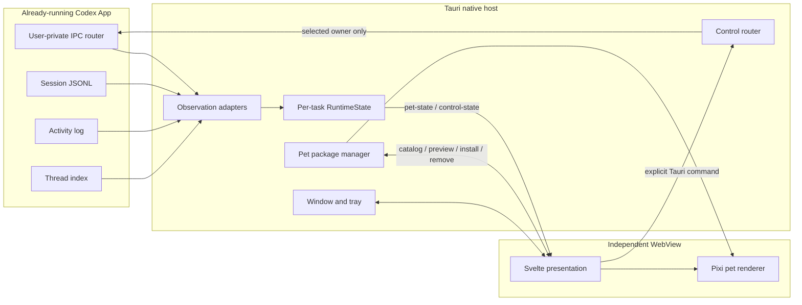

# Runtime architecture

> Status: Normative
> Owns: Runtime modules, interfaces, seams, data flow, trust boundary, and degradation behavior
> Update when: Observation sources, Tauri commands/events, state ownership, renderer ownership, or privacy flow changes
> Last verified: 2026-07-24

## Scope

CoPets attaches to an already-running Codex App. It does not proxy model traffic or modify the Codex WebView. The native host observes local same-user signals, normalizes them per task, and sends a bounded presentation model to an independent pet window.

The native IPC initialize frame retains the compatibility client type `codex-pet-sidecar`. That
value is owned by the private Codex interface contract and is not the CoPets product identity.

The architecture favors deep modules: each external source is hidden behind an adapter, lifecycle complexity stays behind one reducer interface, and the WebView consumes stable snapshots rather than private Codex payloads.

## System flow

## Modules and interfaces

### Observation adapters

Production observation lives under [`src-tauri/src/observer/`](../../src-tauri/src/observer).
[`mod.rs`](../../src-tauri/src/observer/mod.rs) owns the `RuntimeHandle` and starts the IPC,
session, and app-log adapters concurrently.

| Adapter | Input | Interface to reducer | Failure behavior |
| --- | --- | --- | --- |
| IPC follower | Framed messages from the current-user Unix socket | Owner snapshots, authoritative active/terminal state, pending controls | Rejects symlink/non-socket/foreign-owner paths and foreign peers before initialization; controls remain unavailable |
| Session tail | Same-user, non-symlink append-only session JSONL | Turn lifecycle and bounded display context | Existing selected state remains; no backward transcript scan |
| App-log selector | Same-user, non-symlink owner routes and accepted activity records | Selected task candidate | Keeps last confirmed selection rather than choosing noisy background work |
| Thread index | Same-user, non-symlink read-only local index | Ordinary task membership for selection filtering | Strict foreground UUID activity can still confirm a projectless conversation absent from this index |

Session and app-log adapters share [`file_tail.rs`](../../src-tauri/src/file_tail.rs), whose cursor
preserves incomplete UTF-8 bytes and resets on truncation, same-size rewrite, or file identity
change. Local evidence discovery accepts only regular files owned by the effective user. Reads open
with no-follow semantics and revalidate the opened file. Path-based IPC and SQLite consumers also
require a root- or same-user-owned ancestor chain with no group/world-writable directory before the
SQLite index is revalidated and queried read-only. Their directory scans, file reads, and SQLite query execute on blocking workers. One
`AppLogSelectionAdapter` owns known threads, cursors, and confirmed selection for both background
polling and explicit steering refresh. An unindexed conversation is accepted only from an explicitly
active, focused, visible owner-stream activity record with a canonical UUID; weaker or malformed
unknown candidates and unindexed historical owner routes still fail closed. An explicit root owner
route clears cached route and activity authority before the next foreground candidate is evaluated.

The standalone Node adapters in [`src/`](../../src) are diagnostic probes, not the desktop runtime.
[`src/cli.mjs`](../../src/cli.mjs) selects the IPC, session, and log probes and emits sanitized
newline-delimited source evidence for inspection. [`append-follower.mjs`](../../src/append-follower.mjs)
owns their shared cursor, UTF-8 carry, truncation, and rotation mechanics. Session events expose
allowlisted record discriminators and hashed IDs without lifecycle states. App-log events expose
known-thread activity facts without selecting a task; a missing thread index fails closed.

### Runtime state module

[`runtime.rs`](../../src-tauri/src/observer/runtime.rs) owns `RuntimeState`, `RuntimeSnapshot`,
`ThreadLifecycle`, authorization predicates, and `reduce_lifecycle`.
Each task is one `ThreadRecord` containing lifecycle, display context, control owner, pending
requests, and owner-refresh state. Session records, IPC snapshots, selection, and connectivity enter
through `RuntimeEvent`; one reducer transaction updates the record before deriving WebView effects.

Its interface guarantees:

1. Every hashed task ID owns an independent lifecycle, context, and control record.
2. Selection is stored separately; only `threads[selected]` drives the visible pet.
3. A terminal epoch rejects late JSONL progress.
4. An authoritative IPC active snapshot or a new question may start a new epoch.
5. Equivalent state updates do not restart presentation animation.
6. Renderer payloads contain bounded previews and opaque identifiers, never raw private snapshots.

Detailed ordering and selection rules belong to [multi-session arbitration](multi-session-state.md).
Its lifecycle census is the canonical state vocabulary.

### Control router

[`src-tauri/src/control.rs`](../../src-tauri/src/control.rs) converts private pending requests into
compact control models. Command handlers in
[`commands.rs`](../../src-tauri/src/observer/commands.rs) use the authorization contract from
[`runtime.rs`](../../src-tauri/src/observer/runtime.rs) to revalidate selected task, live owner,
lifecycle, and request identity immediately before dispatch.

The interface exposes explicit approval/answer, steering, and stop operations. Capability
projection and dispatch share the selected `working` task, connected IPC, and exact non-stale owner
predicate. There is no global fallback owner. Steering builds only a steer request; it never starts
a new turn or activates Codex App.

### Pet package manager

[`src-tauri/src/pet.rs`](../../src-tauri/src/pet.rs) owns `PetPackageManager` and the `list_pets`, `load_pet`, `preview_pet_import`, `install_pet`, `remove_pet`, and `open_pets_folder` commands. It confines asset paths to one package directory and validates manifest identity, media type, byte size, sprite version, grid geometry, and render scale before returning a data URL plus cell metadata.

Folder, manifest-file, and ZIP inputs share one prepare/validate interface. Preview performs full validation without activation. Installation copies into same-filesystem staging, validates the copy, and activates it with rename or an atomic macOS directory swap. Installed directory symlinks and ambiguous duplicate archive names are rejected. Removal first moves the package out of discovery and rolls back that move if deletion fails. The WebView decides only when an explicit user action should invoke these operations; native code owns filesystem mutation and conflict enforcement.

The package contract is documented in [Pet packages](../protocol/pet-package.md).

### Native shell

[`src-tauri/src/lib.rs`](../../src-tauri/src/lib.rs) builds the Tauri app, registers commands, owns the menu-bar status item, starts observation, performs native dragging, and emits focus-independent pointer hover changes. The status item toggles pet visibility, creates an independent settings window at screen center on demand, and quits the app. Opening settings focuses only that window; a hidden pet remains hidden and its saved geometry is untouched. Closing the detached window destroys it so the next menu-bar request starts from a fresh visible window. The inline and detached settings surfaces are mutually exclusive: the menu-bar entry dismisses inline settings, while the pet entry destroys any detached window before opening locally. [`src-tauri/tauri.conf.json`](../../src-tauri/tauri.conf.json) owns the persistent pet-window definition and bundle configuration, including first-mouse acceptance so an inactive pet can begin dragging on the first press; `show_settings_window` owns detached-window creation and geometry.

Window position and size are stored by [`ui/PetWindow.svelte`](../../ui/PetWindow.svelte).
[`ui/lib/window-resize.js`](../../ui/lib/window-resize.js) owns monitor normalization and
selection, restore/reset clamping, minimum dimensions, proportional corner geometry, resize-session
identity, and pointer-update coalescing.

### Presentation and renderer

[`ui/App.svelte`](../../ui/App.svelte) routes each native window label to a distinct root.
[`ui/PetWindow.svelte`](../../ui/PetWindow.svelte) subscribes to `pet-state` and `control-state` and
owns Pixi, bubbles, controls, drag/resize interactions, and the single live reduced-motion query.
[`ui/SettingsWindow.svelte`](../../ui/SettingsWindow.svelte) initializes no Pixi, drag, hover, or
pet-window geometry. Inline and detached hosts both render
[`ui/SettingsPanel.svelte`](../../ui/SettingsPanel.svelte), while their roots retain different
open/close and event-routing behavior.

[`ui/lib/pet-catalog-controller.js`](../../ui/lib/pet-catalog-controller.js) owns catalog snapshots,
selection commits, render invalidation, stale-refresh rejection, and same-ID reload after catalog
mutation. Selection-only events load from the receiver's current catalog without rescanning or
re-persisting; catalog-mutation events request an explicit rescan. Deterministic fallback selection
after a real catalog change remains in [`ui/lib/pet-catalog.js`](../../ui/lib/pet-catalog.js).
Cross-window selection delivery failures produce a bounded transient message; native error text,
paths, and event payloads are not reflected into the WebView.

[`ui/lib/pixi-pet.js`](../../ui/lib/pixi-pet.js) is the Pixi adapter.
[`ui/lib/pet-presentation.js`](../../ui/lib/pet-presentation.js) owns each selected-pet or preview
operation from fetch through decode and commit. One operation generation invalidates cancelled or
superseded work while the Pixi adapter retains cleanup checks after asynchronous decode.
[`ui/lib/pet.js`](../../ui/lib/pet.js) maps normalized states to atlas rows and terminal behavior.
[`ui/lib/motion-preference.js`](../../ui/lib/motion-preference.js) owns the media-query listener and
injects its current value into the Pixi adapter; live changes update both Svelte transitions and
Pixi frame advancement.
Bubble formatting and visible-prefix trimming are isolated in
[`ui/lib/markdown.js`](../../ui/lib/markdown.js),
[`ui/lib/conversation-display.js`](../../ui/lib/conversation-display.js), and
[`ui/lib/bubble-overflow.js`](../../ui/lib/bubble-overflow.js).

## Native/WebView seam

Native-to-WebView events:

| Event | Payload role |
| --- | --- |
| `pet-state` | Selected task lifecycle and bounded conversation context |
| `control-state` | Selected task control availability and compact pending requests |
| `pet-window-hover` | Pointer-inside-window state without focus transfer |
| `refresh-settings` | Targeted native-to-settings catalog refresh after the independent window is created or revealed |
| `close-inline-settings` | Menu-bar-to-pet request to dismiss the inline settings surface before revealing the detached panel |
| `pet-catalog-changed` | Settings-to-pet catalog-mutation/rescan request carrying a preferred package ID and same-ID reload hint |
| `pet-selection-changed` | Bidirectional exact selection update carrying only the selected package ID; never implies a catalog rescan |
| `reset-pet-window` | Settings-to-pet request to run the pet window's existing reset path |

WebView-to-native commands include snapshot reads, explicit control dispatch, stop, steering, pet catalog/load/preview/install/remove/open-folder operations, pointer polling, detached-settings closure, and window operations. Native file and confirmation dialogs are provided through scoped Tauri plugins. [`src-tauri/src/lib.rs`](../../src-tauri/src/lib.rs), [`capabilities/default.json`](../../src-tauri/capabilities/default.json), and [`capabilities/settings.json`](../../src-tauri/capabilities/settings.json) are the registration and permission sources of truth.

## Privacy boundary

- Raw task/request IDs, owner routes, and exact private IPC payloads stay in native memory.
- Same-UID local processes are inside this trust boundary; CoPets does not isolate Codex from a
  malicious process already running with the current macOS user's privileges.
- IPC initialization requires both a same-user socket path and same-user connected peer.
- Path-based IPC and SQLite access rejects writable or foreign-owned ancestor directories.
- Session, app-log, and thread-index inputs reject symlinks, non-regular files, and foreign owners.
- The renderer receives only opaque action IDs and bounded selected-task previews.
- Hidden reasoning, tool arguments, command output, full answer bodies, background-task content, and unrelated snapshot history do not cross the seam.
- Conversation previews are not persisted by CoPets.
- Import source paths exist only for the active native-dialog/preview operation and are not persisted.
- Incoming control requests to the diagnostic Node IPC observer are rejected.
- Diagnostic IPC output uses method-specific schemas. It emits bounded enums, booleans, integers,
  and hashes of explicitly known identifiers; unknown fields and free-form strings are omitted.
- Diagnostic session and app-log output contains only allowlisted source facts and hashed
  identifiers. Node code does not emit lifecycle or selected-task classifications.

Exact limits belong to constants and tests in the observer/control implementations. Security and legal analysis remains a dated [research snapshot](../research/security-and-legal-boundary.md), not a permanent guarantee.

## Degradation model

| Failure | Expected behavior |
| --- | --- |
| IPC unavailable, untrusted, or owner stale | Hide controls; continue best-effort lifecycle from trusted JSONL |
| Activity schema unavailable | Keep last confirmed selected task; reject unknown candidates |
| Thread index missing a projectless conversation | Accept only canonical-UUID active/focused/visible owner-stream evidence; otherwise keep the last selection |
| Session tail unavailable | Keep current state; do not infer completion |
| Imported pet invalid | Keep the installed package unchanged and show the validation error |
| Manually placed pet invalid | Exclude it from selection and list its folder-level diagnostic in settings |
| Saved monitor missing | Clamp restored window to an attached display |
| Reduced motion enabled | Hold a stable state frame and avoid looping animation |

Unknown private protocol data is ignored or surfaced as unavailable. It must never be converted into a fabricated success state.

## Test surfaces

| Module interface | Primary verification |
| --- | --- |
| Node observation adapters and append following | [`test/observer.test.mjs`](../../test/observer.test.mjs), [`test/append-follower.test.mjs`](../../test/append-follower.test.mjs) |
| Lifecycle, selection, control routing | Adapter-local Rust tests under [`observer/`](../../src-tauri/src/observer), cross-module contracts in [`observer/tests.rs`](../../src-tauri/src/observer/tests.rs), and [`control.rs`](../../src-tauri/src/control.rs) |
| Pet package validation, mutation, catalog ordering, and presentation cancellation | Inline Rust tests in [`pet.rs`](../../src-tauri/src/pet.rs), [`test/pet-presentation.test.mjs`](../../test/pet-presentation.test.mjs), [`test/pet-catalog-controller.test.mjs`](../../test/pet-catalog-controller.test.mjs), and [`test/pet-catalog.test.mjs`](../../test/pet-catalog.test.mjs) |
| Animation/presentation | [`test/pet-animation.test.mjs`](../../test/pet-animation.test.mjs) and [`test/conversation-display.test.mjs`](../../test/conversation-display.test.mjs) |
| Window interaction and motion preference | Drag, pointer, resize, motion-preference, and interaction regression tests under [`test/`](../../test) |

Test commands and change-specific gates belong to [Updating and release](../maintenance/updating.md).
