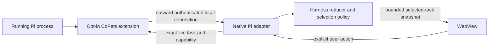

# ADR 0001: Pi extension CoPets bridge

> Status: Proposed
> Owns: Decision to integrate Pi through an opt-in in-process extension and authenticated local bridge
> Update when: Bridge transport, ownership, lifecycle, trust, or status changes
> Last verified: 2026-07-24

## Context

CoPets currently observes and controls Codex through native adapters, reduces every task
independently, and exposes only a bounded selected-task snapshot to the WebView. Pi already offers a
documented TypeScript extension API with session, turn, message, tool, reload, and shutdown events.
It also provides in-process message-delivery methods. Using that extension surface gives Pi-specific
code the runtime context it needs without parsing terminal output or patching Pi core.

The extension is not a sandbox. Pi extensions execute arbitrary code with the Pi process's full
system permissions, and Node networking and process APIs are available. An external bridge therefore
creates a privileged local control boundary. It must be explicitly installed, narrowly scoped,
authenticated, bounded, unloadable, and unable to bypass CoPets' selected-task and explicit-action
invariants.

Current evidence is pinned to Pi 0.80.3. Local Unix-socket communication is a CoPets design built
from ordinary Node capabilities, not a Pi transport promise. Live event payloads, session identity,
control behavior during replacement, and compatibility across Pi versions remain unproven.

## Decision

Adopt the following design for the Pi adapter, subject to this ADR becoming Accepted:

1. **Use Pi's extension mechanism.** Ship a small, separately identifiable Pi extension. Installation
   and trust are explicit user actions. Do not inject into Pi, patch its distribution, scrape its
   terminal, or make Pi load an undocumented native component.
2. **Connect outward.** CoPets' native process owns the only listener, normally a Unix-domain
   socket inside a user-private runtime directory. The extension factory starts no long-lived work.
   On `session_start` the extension connects to CoPets and begins a bounded reconnect policy; every
   timer, listener, socket, and pending action is closed idempotently on `session_shutdown`, session
   replacement, or reload. The accepted baseline has no remote or public TCP listener.
3. **Authenticate and version the bridge.** CoPets creates an ephemeral endpoint and per-launch
   credential. A handshake binds protocol version, connection generation, extension instance, Pi
   version, opaque session identity, declared capabilities, and fresh challenge material. Frames are
   length-delimited and bounded, carry sequence and correlation identifiers, and reject unknown major
   versions, invalid credentials, replay, duplicates, stale generations, malformed data, and
   backpressure overflow. Exact credential bootstrap, encoding, limits, and same-user attacker model
   must be resolved before this ADR can be Accepted.
4. **Keep the extension thin.** It translates allowlisted Pi events into the versioned bridge schema,
   bounds user-visible previews, maintains any raw-ID-to-opaque-ID mapping, and invokes only explicit
   allowlisted Pi API methods. It does not choose the visible task, reduce lifecycle epochs, render
   UI, retain transcripts, infer unsupported state, or execute arbitrary commands.
5. **Keep policy native.** The native Pi adapter owns handshake validation, normalization,
   connection generations, capability state, per-task reduction, central selection integration,
   diagnostics, and final action validation. Pi task identities are opaque and adapter-namespaced.
   Raw Pi identifiers and raw event payloads stay inside the extension process; they are never sent
   to the WebView or logs.
6. **Preserve one reducer and selection authority.** Pi events enter the same Harness module contract
   as other adapters. Each task owns independent lifecycle, context, epoch, and controls. The central
   policy alone chooses the visible task; the extension may provide source evidence but cannot set a
   second global selection or control owner.
7. **Constrain controls.** CoPets sends a control frame only after an explicit user action and only
   for the exact selected task, current connection generation, live turn epoch, declared capability,
   and unexpired action identity. The extension revalidates its local session and turn before calling
   a documented Pi API. `pi.exec`, arbitrary command/tool execution, generic evaluation, hidden
   new-turn creation, and cross-session fallback are outside this protocol.
8. **Fail closed.** Missing extension, authentication or version failure, unknown schema, disconnect,
   reload, stale owner, and unsupported actions become unavailable or ignored evidence. Safe cached
   lifecycle may remain visible, but controls disappear. No heuristic observer or previous/global
   owner takes over.

## Interface impact

The future Harness module receives adapter-namespaced opaque task events, bounded presentation
context, lifecycle evidence, connection health, and explicit capability descriptors. It dispatches
an action through an adapter only after central validation. The Pi adapter is split across two
privileged pieces—the in-process extension and native CoPets adapter—but together must satisfy the
same contract and conformance suite as an in-process native adapter.

The WebView contract does not expand to include raw identifiers, full transcripts, hidden reasoning,
tool arguments, command output, credentials, bridge frames, or background-task content. Accepting
this ADR will require reconciling the normative runtime and multi-session documents before code is
merged.

Open acceptance questions are the credential-bootstrap mechanism, frame encoding and hard limits,
heartbeat and reconnect timing, stable opaque identity across reload, Pi multi-process/session
selection evidence, feature negotiation across Pi versions, and install/update UX.

## Alternatives

### Observe Pi externally

Parse terminal output, logs, or process state without an extension. This is simpler to install but
cannot reliably prove session ownership, rich lifecycle, or safe controls, and repeats the fragile
private-observation problem the Harness seam is intended to isolate. Rejected as the primary path.

### Patch or inject into Pi core

Modify Pi's installed code or attach an undocumented runtime hook. This has tighter access but is
invasive, version-fragile, difficult to uninstall, and unnecessary while a documented extension API
exists. Rejected.

### Let the extension host a server

Have every Pi process expose a socket or HTTP listener for CoPets. This increases discovery and
attack surface, complicates multiple instances, and makes cleanup failures leave a privileged
listener behind. Rejected in favor of the extension connecting outward to one CoPets-owned endpoint.

### Run Pi only through RPC mode

Launch and own a separate Pi RPC process. RPC may be useful for tests or future managed sessions, but
it does not attach the pet to the user's already-running interactive Pi instance and changes product
semantics. Deferred, not the default integration.

## Consequences

- Pi integration follows a supported, user-extensible surface and can observe in-process lifecycle
  without changing Pi core.
- Reload and uninstall have explicit cleanup points, and each Pi connection can advertise its actual
  capabilities instead of pretending parity.
- The plugin is a high-trust component with host permissions. Distribution, source review, consent,
  updates, and diagnostics must make that trust visible.
- CoPets must maintain a second artifact and a private, versioned local protocol in addition to the
  native adapter. Authentication, backpressure, reconnection, identity, and compatibility add real
  implementation and test cost.
- Initial releases may remain observation-only. Actions become available individually only after
  live proof; withdrawing a broken capability is preferred to unsafe fallback.
- The rollback path is to disable or uninstall the extension and leave Pi support unavailable. Codex
  and other adapters must continue independently.

## Verification

Before changing this ADR to Accepted and claiming Pi support:

1. Install and trust a minimal extension through supported Pi mechanisms; verify disable, uninstall,
   session switch/fork, `/reload`, and idempotent `session_shutdown` cleanup on Pi 0.80.3 and every
   declared supported version.
2. Capture sanitized live traces for session start, turn start/end, bounded message updates, terminal
   state, disconnect, reconnect, replacement, and old-generation rejection.
3. Test endpoint ownership and permissions, positive and negative authentication, version
   negotiation, invalid credentials, replay, duplicate/out-of-order and oversized frames,
   backpressure, timeout, and token leakage surfaces.
4. Run two Pi sessions plus another adapter; prove opaque identity namespacing, per-task isolation,
   one selection authority, terminal sealing, and no state/control contamination.
5. For each proposed action, test exact task/session/turn/request binding, explicit user initiation,
   timeout, disconnect, stale owner, unsupported capability, and denial. Confirm the bridge cannot
   invoke `pi.exec`, arbitrary tools, or arbitrary commands.
6. Inspect renderer events and logs to confirm they contain no raw Pi identifiers, credentials, raw
   event payloads, hidden reasoning, tool arguments, command output, full transcripts, or background
   content.
7. Run the shared adapter conformance suite, `npm run check`, the Rust test suite, and the relevant
   live integration gates before updating the feature catalog and changelog.

## References

- [Roadmap](../roadmap.md)
- [Pi extension research snapshot](../research/pi-extension-integration.md)
- [Runtime architecture](../architecture/runtime.md)
- [Multi-session arbitration](../architecture/multi-session-state.md)
- [Updating and release](../maintenance/updating.md)
- [Official Pi extensions guide](https://github.com/earendil-works/pi/blob/main/packages/coding-agent/docs/extensions.md)
- [Official Pi ExtensionAPI types](https://github.com/earendil-works/pi/blob/main/packages/coding-agent/src/core/extensions/types.ts)
