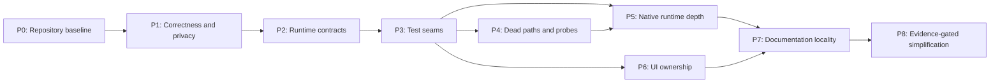

# Architecture repair plan

> Status: Complete
> Owns: Ordered remediation backlog, dependencies, acceptance gates, and evidence thresholds for the 2026-07-20 whole-codebase review
> Update when: A repair phase changes scope, order, status, evidence, acceptance criteria, or completion state
> Last verified: 2026-07-24

This is the single execution plan for the current architecture, organization, and
overengineering review. It merges the original whole-codebase review with the later
overdesign and over-defensive implementation review.

It does not own product milestones. Claude Code, Pi, Actions v2, the Pet Marketplace, and public
distribution remain in the [product roadmap](../roadmap.md). Long-lived topology and trust choices
remain in [architecture decision records](../decisions/README.md). Current behavior remains owned by
the [feature catalog](../features/catalog.md) and executable source.

## Starting baseline

- Clean public baseline: commit `9297734` on `main`.
- Full pre-repair local backup: commit `e303fbd` on
  `backup/pre-repair-20260720-225354`; this branch must never be pushed because it contains ignored
  local generation evidence.
- At plan start, `npm run check` passed with 59 Node/UI tests, the frontend production build,
  documentation validation, and `cargo check`.
- At plan start, `cargo test --manifest-path src-tauri/Cargo.toml` passed 54 Rust tests.
- Overdesign is localized, not systemic. Deep safety modules and runtime invariants listed below
  must remain intact.
- Confirmed defects, policy gaps, structural repairs, and evidence-only hypotheses are kept
  separate. A hypothesis cannot authorize deleting a defense.

## Target outcome

CoPets should have:

1. one owner for each lifecycle, selection, control, presentation, and documentation policy;
2. deep modules with narrow interfaces instead of parallel shallow policies;
3. tests across caller-visible interfaces rather than source spelling and file layout;
4. diagnostic probes that report evidence without becoming a second product state machine;
5. no generated or private evidence in the source baseline; and
6. no speculative Harness abstraction before a second real adapter proves shared variation.

## Dependency map



P5 and P6 may proceed independently after P3. P8 is not permission to simplify; it is a gate for
collecting the missing evidence first.

## Phase status

| Phase | Status | Primary outcome |
| --- | --- | --- |
| P0 | Complete | Curated, reproducible initial repository baseline |
| P1 | Complete | Close the known pet-presentation race and privacy policy gap |
| P2 | Complete | One explicit lifecycle, selection, control, and probe contract |
| P3 | Complete | Behavioral test seams that permit safe refactoring |
| P4 | Complete | Remove retired paths and duplicate diagnostic policy |
| P5 | Complete | Deep per-task native runtime with localized adapters |
| P6 | Complete | Separate window implementations and one pet-presentation owner |
| P7 | Complete | One fact per document owner and revision-pinned evidence |
| P8 | Complete | Evidence retained defenses and rejected speculative transport |

## P0 — Curate the repository baseline — Complete

Do this before the initial commit.

Work:

- Classify source, curated design assets, generated evidence, and private/local artifacts.
- Ignore or relocate `artifacts/`; it currently contains generation prompts, request payloads,
  videos, frame dumps, and absolute local provenance.
- Audit generated `src-tauri/gen/` before deciding whether it belongs in source control.
- Record an explicit keep/ignore policy for `design/` rather than inheriting it accidentally from
  `git add -A`.
- Establish the initial commit only after the staged-file audit and full gate pass.
- Pin subsequent walkthrough and compatibility evidence to a commit SHA.

Acceptance:

- `git add -A --dry-run` stages no prompts, answers, raw payloads, transient media, credentials,
  stable user identifiers, or absolute user paths.
- A clean checkout can install dependencies and pass the required local gate.
- The first revision contains the intended source and curated assets only.

Completion evidence: `artifacts/` and exploratory `design/` are ignored; required Tauri schemas
remain committed; staged-path and absolute-path audits passed; a detached clean checkout of
`9297734` completed `npm ci`, `npm run check`, and the Rust test suite.

## P1 — Fix confirmed correctness and privacy-policy gaps — Complete

### P1.1 Pet presentation cancellation — Complete

The previous UI split invalidation authority across [`App.svelte`](../../ui/App.svelte),
`pet-loader.js`, and `pet-render-coordinator.js`. A reproduced interleaving showed that cancelling
the render coordinator while `load_pet` was still pending could allow the old pet to render after
clear or removal. [`pet-presentation.js`](../../ui/lib/pet-presentation.js) now owns that complete
operation and the two shallow modules are retired.

Work:

- Add a failing cross-module test for `pending fetch -> clear/cancel -> fetch resolves`.
- Introduce one pet-presentation operation owner covering `fetch -> decode -> commit`.
- Keep invalidation checks after every asynchronous step; consolidate ownership rather than
  removing race guards.
- Commit selected-pet persistence only after rendering succeeds. Cover load failure, same-ID
  replacement, preview cancellation, and empty-catalog fallback.

Acceptance:

- No cancelled or superseded operation can update textures, selection, persistence, or visible
  state.
- Existing decode and texture cleanup guarantees remain covered.

Completion evidence: the cross-module failure was reproduced before implementation;
`pet-presentation.test.mjs` covers clear, superseding selection, external preview invalidation,
in-flight decode, and destroy; the 75-test Node/UI gate and frontend build pass.

### P1.2 Probe privacy hardening — Complete

[`collectSafeFields`](../../src/privacy.mjs) accepts arbitrary strings under several allowlisted
key names. An isolated adversarial input can therefore pass free-form text through `reason`,
`status`, or similar keys. This proves a sanitizer policy gap; it does not by itself prove that a
current Codex payload places private text in those fields.

Work:

- Add adversarial tests for allowlisted-key strings, nested objects, arrays, excessive depth,
  oversized values, raw identifiers, prompts, answers, tool content, and prototype-shaped input.
- Replace generic recursive string collection with source- or method-specific sanitizers.
- Keep only bounded enums, booleans, numbers, top-level key names, and hashes of explicitly known
  identifier fields. Unknown strings are omitted.
- Preserve inbound-control rejection and local-only diagnostic behavior.

Acceptance:

- Sanitized fixtures contain no raw IDs or free-form private content.
- Unknown schema changes reduce diagnostic detail instead of widening disclosure.
- Node observer tests and the security/privacy change gate pass.

Completion evidence: the recursive key-name policy was replaced by bounded method-specific
schemas; adversarial tests cover formerly allowlisted free-form text, oversized metadata and IDs,
excessive and hostile key shapes, inherited objects, and nested private content. The 79-test
Node/UI gate, frontend build, documentation validation, `cargo check`, and 48-test Rust suite pass.

## P2 — Reconcile runtime contracts before structural work — Complete

### P2.1 Lifecycle and control vocabulary

Target product contract:

- A live turn remains `working` until a real review or terminal transition.
- Approval and question availability are represented by control cards, not by a second lifecycle
  state.
- `completed`, `failed`, and `interrupted` settle visually, then return to idle presentation without
  reopening the task epoch.

Work:

- Build a state census mapping every normalized state to its producer, reducer transition,
  renderer row, control presentation, canonical document, and behavioral test.
- Verify pending approval/question behavior against the current Codex App.
- Unless live evidence contradicts the target contract, remove the unproduced `needs-input`,
  `needs-approval`, and `needs-attention` lifecycle residue from native, UI, CSS, animation mapping,
  tests, and normative docs.
- Verify whether `reviewing` and the JSONL fallback still occur before changing them.
- Remove unproduced `error` vocabulary or introduce one canonical producer; do not keep consumer-only
  aliases.

Acceptance:

- Emitted, reduced, rendered, documented, and tested vocabularies match exactly.
- Pending controls do not cause `waiting <-> working` churn.
- Late fallback progress still cannot reopen a terminal epoch.

### P2.2 Task record and selection contract

Define one per-task record containing lifecycle, bounded display context, and pending control state.
Keep selected-task identity separate. This is the normative target for P5; P2 does not yet require
mechanical file movement.

Acceptance:

- The contract states which data is source fact, reduced state, operation state, or derived WebView
  projection.
- Background task updates remain isolated.
- Capability projection and dispatch authorization name the same predicates.

### P2.3 Diagnostic probe role

Rust remains the sole production lifecycle and selection policy. Node probes collect sanitized
source evidence for compatibility work; they do not claim semantic parity unless shared fixtures
enforce it.

Acceptance:

- The feature catalog and runtime documentation no longer claim unenforced probe parity.
- Any retained normalized probe field is backed by a shared fixture or explicitly labelled
  diagnostic-only.

Completion evidence: [multi-session arbitration](../architecture/multi-session-state.md) now owns
the exact lifecycle census and source/reduced/operation/projection layers. Unproduced waiting and
error aliases were removed from native control predicates and UI presentation; pending controls
remain `working`; stop, steering, approval, and answer dispatch share the selected live-owner
predicate. Steering builds no start-turn payload. All Node probe events identify themselves as
diagnostic-only and normative docs make Rust the sole production policy. The 79-test Node/UI gate,
frontend build, documentation validation, `cargo check`, and 50-test Rust suite pass. Current Codex
App private-interface compatibility remains an evidence task under P8 and is not inferred here.

## P3 — Replace implementation-shape tests with interface tests — Complete

Do this before moving native or UI code.

Work:

- Extract real configuration-value assertions from the retired source-regex suite into
  [`configuration-contract.test.mjs`](../../test/configuration-contract.test.mjs).
- Replace source-regex assertions over function names, CSS ordering, SVG paths, and Rust call chains
  with behavioral, mounted UI, visual, or macOS integration tests.
- Keep [`product-identity.test.mjs`](../../test/product-identity.test.mjs); package, bundle, signing,
  and storage identities are caller-visible contracts. The pre-release CoPets rename reset the
  former DeskPal-era bundle and storage values before any tagged public release.
- Add runtime interface tests around lifecycle reduction, selected-task projection, control
  authorization, and adapter events. Stop mutating broad private `RuntimeState` internals from
  unrelated test modules.
- Add mounted or integration coverage for settings-window hosting, streaming bubbles, runtime
  reduced-motion changes, catalog replacement, and load rollback before extracting those paths.

Automated browser mounting is not introduced solely for this phase. Pure policies are exercised
through Node interfaces; focus, two-window hosting, rendered motion, and geometry use the signed
bundle checklist in [the M0 walkthrough](m0-clean-profile-walkthrough.md).

Acceptance:

- A whitespace-only or behavior-preserving file move does not fail tests.
- Configuration, identity, privacy, lifecycle, and user-visible behavior remain protected.
- Structural phases can move code without first rewriting tests that know private layout.

Completion evidence: the 29-test source-regex suite was removed. Parsed JSON configuration and
capability contracts, executable signing-identity precedence, current product storage keys, control input,
cross-window pet sync, monitor selection, reduced-motion policy, selected snapshot projection,
exact pending-control authorization, IPC initialization, and stop dispatch now have interface
tests. Existing queue, overflow, drag, resize, pet-presentation rollback, lifecycle, and privacy
tests remain. Focus, two-window hosting, rendered geometry, and appearance are owned by the signed
bundle walkthrough. `npm run check` passes 59 behavioral/configuration Node tests, the frontend
build, docs, and `cargo check`; all 54 Rust tests and shell syntax checks pass.

## P4 — Remove retired paths and duplicate probe policy — Complete

Work:

- Narrow `build_follow_up` in [`control.rs`](../../src-tauri/src/control.rs) to the steering request
  actually dispatched. Keep the negative test that steering never starts a new turn.
- Remove test-only or unused exports after their caller-visible replacement tests exist, including
  `deriveConversationBubbles` and obsolete probe path helpers.
- Resolve consumerless snapshot fields only after confirming no WebView or integration consumer.
- Stop silently swallowing cross-window event failures; report bounded diagnostic context.
- Shrink Node probes to transport, tailing, framing, redaction, and sanitized source facts.
- Remove duplicate Node lifecycle/selection classification and fail-open `unverified` selection.
  Unknown thread-index state must retain the last confirmed selection or emit a non-authoritative
  candidate, never a selected task.
- If full Node tailers remain, consolidate their append-only file-following implementation only
  after public-interface tests cover cursor, UTF-8 carry, rotation, truncation, and stop behavior.

Acceptance:

- No code constructs a start-turn request for steering.
- No production state-name mapping or selection authority remains in diagnostic JavaScript.
- `npm run probe:*` still produces useful sanitized compatibility evidence.
- Unknown diagnostic schema and index failure remain fail closed.

Completion evidence: steering retains only its dispatched request; retired snapshot/path/bubble
exports and consumerless WebView fields were removed. Cross-window pet selection failures now use a
fixed transient error. Session and app-log probes emit allowlisted facts and hashes without Node
lifecycle or selection policy, and app-log index failure drops candidates. One append follower owns
cursor, UTF-8 carry, truncation, rotation, and read locking; public tests cover those mechanics and
tailer stop behavior. The 63-test Node/UI gate, frontend build, documentation validation,
`cargo check`, and 54-test Rust suite pass; live probes remain part of the P8 evidence gate.

## P5 — Deepen and split the native runtime — Complete

Behavioral contracts and interface tests from P2-P3 must land first. Do not begin by splitting a
large file.

Work:

- Replace parallel per-task maps with a cohesive `ThreadRecord` containing lifecycle, display
  context, and control state; keep transient operation guards explicit.
- Apply narrow adapter events through one reducer transaction and derive the selected WebView
  snapshot from the selected record.
- Introduce one private authorization interface parameterized by current action kind. Use it for
  capability projection and immediate dispatch revalidation while retaining post-await request
  identity checks.
- Let one app-log selection adapter own cursors, known threads, confirmed selection, and
  `refresh_now`; background observation and explicit actions use the same implementation.
- Replace the native lossy append reader with an incremental UTF-8 cursor that detects truncation
  and file identity changes; cover split code points, rotation, and same-size rewrite behavior.
- Move blocking log scans and SQLite work off the async executor.
- Only after ownership is localized, split the [`observer` module](../../src-tauri/src/observer) into
  internal runtime-state, IPC, session, app-log/selection, and command modules. Move tests with
  their owning interfaces.
- Do not introduce a generic Harness trait in this phase.

Acceptance:

- Selected/background, terminal sealing, disconnect/reconnect, pending control, stale owner, and
  post-await identity scenarios pass through public runtime interfaces.
- Exact owner/request routing and no-global-fallback behavior are unchanged.
- Snapshot fields have a consumer or are removed.
- Required local and macOS integration gates pass with no behavior regression.

Completion evidence: one `ThreadRecord` and reducer transaction own lifecycle, bounded context,
controls, and owner refresh. Runtime, IPC, session, selection, and command implementations are
separate deep modules with adapter-local tests plus cross-module contracts. Native append cursors
cover split UTF-8, truncation, same-size rewrite, and rotation; blocking file and SQLite work runs
off the async executor. Stale-owner retry revalidates selection, lifecycle, connectivity,
conversation, host, and replacement owner. The 63-test Node/UI gate, frontend build,
documentation validation, `cargo check`, and 67-test Rust suite pass. Read-only live probes
confirmed IPC attachment, selected/background activity facts, and a terminal session fact; the
locally signed app bundle passed strict `codesign` verification. No live steering or stop action was
sent without an explicit user action.

## P6 — Deepen UI ownership and separate window implementations — Complete

Work:

- Route startup to distinct pet-window and settings-window implementations instead of creating the
  full pet tree and hiding it with CSS.
- Share one settings-panel implementation between its inline and detached hosts.
- Give catalog and selection workflow one owner. Separate catalog changes from selection changes;
  avoid rescanning or reloading when neither changed.
- Deepen the window-geometry module around monitor selection, clamping, restore, resize coalescing,
  and minimum dimensions instead of duplicating numeric policy in `App.svelte`.
- Make the App the single reduced-motion owner and propagate live changes to the Pixi adapter.
- Preserve drag-pointer polling, drag-motion hysteresis, terminal presentation, Markdown safety,
  visible-text overflow calculation, Retina atlas geometry, and texture destruction.
- Avoid fragmenting the remaining pet implementation into leaf modules without a second caller or
  meaningful hidden complexity.

Acceptance:

- Settings mode performs no pet renderer, drag, or hover initialization.
- Inline and detached settings hosts share behavior while retaining their different open/close and
  event-routing strategies.
- Changing reduced motion at runtime updates both Svelte presentation and Pixi animation.
- Cross-window selection, same-ID replacement, load failure, resize/restore, hover, Retina, and
  terminal-settle scenarios pass behavioral and packaged-app checks.

Completion evidence: startup now routes to distinct pet and settings roots; only the pet root
constructs motion, Pixi, drag, hover, terminal, and geometry controllers, while both roots share one
settings component. A catalog controller rejects stale refreshes, separates selection events from
catalog mutation, skips unchanged loads, and forces same-ID replacement reloads. One geometry
module owns monitor normalization, fitting, centering, proportional resize sessions, and update
coalescing; one media-query owner propagates runtime motion changes to Svelte and Pixi. The 76-test
Node/UI gate, frontend build, documentation validation, `cargo check`, and 67-test Rust suite pass.
The locally signed bundle passed strict `codesign`; a build-path process smoke verified the pet
renderer, live bubbles, controls, and shared inline settings. Native window/capability contracts
cover detached settings creation, and the test process was closed without stopping the installed
CoPets instance.

## P7 — Reduce documentation duplication without weakening validation — Complete

Work:

- Keep the documentation metadata and `docs:check`; they currently provide cheap, useful drift
  detection.
- Keep this file as the only repair sequence. The roadmap contains product outcomes and
  dependencies only; ADRs own lasting topology and trust decisions.
- Trim duplicated Pi protocol detail from the roadmap when ADR 0001 is next revised; unresolved
  protocol mechanics stay proposed rather than becoming repair work.
- Split normative M0 walkthrough steps from dated, revision-pinned execution evidence.
- Update the feature catalog when capability, status, behavior, or limits change. Update the
  changelog for release-worthy user-visible behavior; do not create entries for mechanical file
  moves.
- Reconcile implementation and canonical docs in the same phase change.

Acceptance:

- Every durable fact has one canonical owner and secondary documents link to it.
- No repair phase is duplicated in the product roadmap or an ADR.
- Documentation checks pass with no orphaned plan, stale source reference, or broken link.

Completion evidence: the M0 walkthrough now owns only the reusable procedure and packaged UI
checklist; its 2026-07-20 run is an immutable evidence snapshot pinned to
`929773467630c7b7ac082c23c15cec64d3b20743`. The documentation taxonomy and index distinguish
normative, research, evidence, and generated material. The roadmap links the Pi bridge ADR for
protocol and trust mechanics and retains only product outcomes, dependencies, and exit criteria.
Current presentation ownership references name the split window roots, while historical repair
narrative remains intact. `npm run docs:check` passes with all 22 documentation files indexed and
all local links valid; independent manual ownership review found no duplicated repair sequence or
stale current source owner.

## P8 — Evidence-gated simplification — Complete

These items are hypotheses, not confirmed defects.

### Stale-owner retry chain

During a scheduled macOS gate, provoke owner replacement during a live turn and record whether the
stale-owner error, refresh broadcast, and poll recovery execute. Simplify only if repeated evidence
shows part of the chain is unnecessary. Exact selected-owner and post-await identity validation
remain mandatory either way.

### High-resolution atlas transport

Measure 4x atlas load time, peak native/WebView memory, payload size, and preview/reload behavior.
Change the data-URL transport only if the measurement crosses an explicit target. Do not add an
asset protocol on speculation.

### Current private Codex behavior

Reverify review-mode and JSONL fallback selection against the installed Codex App before removing
either path. Preserve older dated research and add a new re-verification record.

Acceptance:

- Each decision cites a dated runtime result, tested app/build version, commit SHA, commands, and
  remaining uncertainty.
- An inconclusive result leaves the current defense intact.

Completion evidence: the dated [P8 runtime snapshot](../research/runtime-simplification-gates-2026-07-21.md)
pins CoPets commit `c7d86439e45a9ee8d75a332f6a3f3a0e4f3717e7`, Codex App
`26.715.52143` build `5591`, the embedded CLI, commands, thresholds, results, and uncertainty.
The stale-owner contract tests pass, but the state-changing live replacement experiment remains
unrun, so all recovery and identity defenses remain. The 4x atlas passed 13/13 load, reload,
preview, and restore operations within the transport thresholds, while WebContent RSS showed that
4x is unsuitable as the default on this machine; 2x remains the default and no speculative asset
protocol was added. Current review-mode runtime evidence was inconclusive, so the mapping remains.
Source audit confirmed that JSONL no longer owns any selection fallback; foreground selection fails
closed through the app-log adapter and known-thread index.

## Complexity that must remain

The repair must not weaken:

- per-task lifecycle/context isolation and selected-task-only presentation;
- terminal epoch sealing and authoritative-only reopen behavior;
- exact selected owner/request checks, stale-owner filtering, post-await identity checks, and the
  follow-up inflight guard;
- raw identifier containment in native memory, opaque WebView IDs, bounded previews, and unknown
  schema fail-closed behavior;
- IPC framing bounds, source validation, local-only transport, and inbound-control rejection;
- ZIP entry/count/size/path/case/symlink/overlap checks, staged-copy validation, atomic replacement,
  rollback, and the mutation lock;
- async invalidation after real await points, texture cleanup, pointer-release detection,
  resize-session identity, and window-state degradation;
- explicit user action for approval, answer, steering, and stop; and
- official pet-package compatibility plus the documented CoPets high-resolution extension.

## Global verification gates

Every implementation phase runs the required local gate from
[`updating.md`](updating.md):

```bash
npm run check
cargo test --manifest-path src-tauri/Cargo.toml
```

Phases touching private Codex interfaces, selection, controls, window behavior, renderer behavior,
Retina transport, or signing also run the documented macOS integration gate. Evidence must cover a
selected working task, a background working task, terminal transition, IPC disconnect/reconnect,
and an explicit control when relevant.

## Completion rule

A phase becomes complete only when its implementation, focused interface tests, canonical docs,
changelog entry when applicable, and required verification agree. Update the phase table and
`Last verified` in the same change. Completing this repair plan does not mark any product roadmap
milestone complete.
