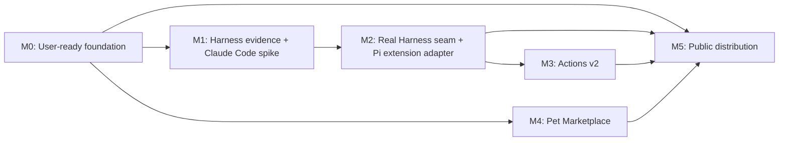

# Roadmap

> Status: Proposed
> Owns: Forward-looking milestones, sequencing, dependencies, and exit criteria; not current feature availability
> Update when: A milestone changes scope, order, status, dependency, exit criteria, or delivery state
> Last verified: 2026-07-25

This roadmap describes intended direction, not promised release dates or current support. The
[feature catalog](features/catalog.md) remains the canonical source for behavior available in the
current build. A milestone becomes complete only after implementation, tests, documentation, and
real-environment evidence agree.

Current architecture remediation is tracked separately in the
[architecture repair plan](maintenance/repair-plan.md). Repair phases do not change milestone
status unless their delivered outcome also satisfies that milestone's exit criteria.

## Roadmap states

- **Next:** Highest-priority product work; not necessarily scheduled.
- **Research:** Requires current external-interface evidence before implementation can be promised.
- **Planned:** Direction accepted, but dependencies or implementation remain unfinished.
- **Blocked:** Cannot proceed without an external decision, capability, or release gate.
- **Complete:** Delivered and reflected in the feature catalog, source, tests, and release evidence.

Terminology: **Pet Marketplace** means the data-only community pet registry in M4. A
**marketplace listing** means a distribution channel for the CoPets application itself in M5.

## Dependency map

| Milestone | Status | Outcome |
| --- | --- | --- |
| M0 | Complete | Normal pet use and local package management no longer depend on an Agent or manual package editing |
| M1 | Research | Reproducible harness-neutral evidence plus a Claude Code feasibility result |
| M2 | Planned | A proven Harness seam with Codex plus a second real adapter; Pi connects through an opt-in extension bridge |
| M3 | Planned | Capability-driven actions beyond the current Codex-specific control set |
| M4 | Planned | A safe, data-only Pet Marketplace built on the delivered local package manager |
| M5 | Planned | Signed public releases and evaluated distribution listings |

## M0 — User-ready foundation

**Goal:** After the app is installed, ordinary use should not require a terminal or an Agent.

Delivered work:

- Add a complete user guide covering installation, first run, Codex connection, pet management,
  controls, privacy, troubleshooting, updating, and removal.
- Add first-run, no-pet, disconnected, and unsupported-version guidance inside the app.
- Add local package import for a folder or archive, with manifest, media, geometry, path, and size
  validation before installation.
- Install or replace packages atomically; expose clear conflict, rollback, and validation errors.
- Add open-folder, preview, delete, rescan, and safe active-pet fallback controls.

Exit criteria:

1. A first-time user can connect to an already-running supported harness and import, select, and
   remove a pet without editing files or invoking an Agent.
2. Invalid or partial packages never become active and produce a useful visible error.
3. The user guide passes documentation checks and a clean-machine walkthrough.

Completion evidence: the current behavior is recorded in the [feature catalog](features/catalog.md),
ordinary operation is documented in the [user guide](user-guide.md), the reusable procedure lives in
the [M0 walkthrough](maintenance/m0-clean-profile-walkthrough.md), and the completed baseline is
pinned in the [2026-07-20 result](maintenance/m0-result-2026-07-20.md).

## M1 — Harness evidence and Claude Code feasibility

**Goal:** Prove a second real harness before freezing a shared interface.

Planned work:

- Capture sanitized, harness-neutral conformance vectors for selection, independent background
  state, active lifecycle, terminal sealing, disconnect/reconnect, bounded display context, and
  explicit controls.
- Keep the current Codex implementation as the regression baseline.
- Run a dated Claude Code adapter spike using current documented or observable local surfaces.
- Start read-only. Add actions only after exact task ownership, capability, and failure behavior are
  demonstrated.
- Publish a capability matrix instead of translating missing behavior into apparent success.

Exit criteria:

1. Codex still passes its existing automated and macOS integration scenarios.
2. Claude Code can replay the normalized lifecycle scenarios with sanitized fixtures and live
   evidence, or the unsupported capability is explicitly recorded.
3. Unknown or changed Claude Code data degrades to unavailable state and never fabricates controls.

An unsupported Claude Code result may complete the research record, but it does not unlock M2. If
Claude Code cannot become a real adapter, M2 remains blocked until another second adapter proves a
useful common shape alongside Codex.

## M2 — Real Harness seam and Pi extension adapter

**Goal:** Create a deep Harness module only after Codex and one second adapter demonstrate real
variation. Integrate the [Pi agent harness](https://github.com/earendil-works/pi) (formerly
`pi-mono`) through its supported extension mechanism instead of patching, injecting into, or
externally guessing the state of a running Pi process. If the Claude Code spike succeeds it joins
the same seam; otherwise Pi may provide the required second real adapter.

Planned work:

- Resolve and accept the proposed [Pi extension bridge ADR](decisions/0001-pi-extension-copets-bridge.md)
  before implementing its transport, identity, trust, privacy, or control boundary. That ADR owns
  the protocol mechanics and security acceptance work.
- Deliver an explicitly installed Pi extension and native adapter through supported Pi mechanisms,
  with unavailable behavior when the integration is absent or incompatible.
- Establish the small shared Harness seam only after Codex and a real second adapter pass the same
  lifecycle, bounded-context, selection, and capability suite.
- Expose only capabilities proven by each live adapter; preserve one visible task-selection
  experience across harnesses.

Current evidence and unresolved compatibility gaps are recorded in the dated
[Pi extension research snapshot](research/pi-extension-integration.md).

Exit criteria:

1. A user can install, trust, reload, disable, and uninstall the Pi extension through supported Pi
   mechanisms without patching Pi core; absence or version mismatch produces a clear unavailable
   state.
2. A live Pi session passes the shared lifecycle, bounded-context, disconnect/reconnect, and
   selection scenarios, including switch/fork where supported.
3. The accepted ADR's complete bridge verification gate passes.
4. At least two production adapters pass one shared interface suite before the seam is stable;
   equal source-local IDs, concurrent sessions, and disabling one adapter cannot corrupt another.
5. Every enabled Pi action has live conformance evidence; unproven actions remain unavailable and
   never fabricate success.

## M3 — Actions v2

**Goal:** Support more action types without assuming every harness implements the same controls.

Planned work:

- Extend M2's minimal capability schema into typed action descriptors and migrate callers away from
  fixed action assumptions.
- Cover approval/deny, structured questions, choices, text input, steering, stop/cancel, and—only
  where proven—pause, resume, retry, or open-session actions.
- Add per-action confirmation, timeout, progress, cancellation, and unavailable-state presentation.
- Keep raw permission payloads, owner routes, and private request identifiers in native memory.
- Revalidate the exact selected task, live owner, action identity, and capability immediately before
  dispatch.

Exit criteria:

1. Unsupported actions remain hidden or explicitly unavailable; they never fall back to another
   harness or task.
2. Every supported action type has adapter contract tests, UI tests, stale-owner tests, and a
   real-harness verification scenario; unsupported types have negative capability and unavailable
   state evidence.
3. All dispatch remains an explicit user action.

## M4 — Pet Marketplace

**Goal:** Let users discover and manage community pets without allowing packages to execute code.

Planned work:

- Accept an ADR for registry identity, package versioning, persistent metadata, publisher trust, and
  rollback ownership before implementing the format or trust model.
- Build on the M0 local package manager rather than creating a second installation path.
- Define a versioned registry entry containing compatibility, size, checksum, author, license,
  attribution, homepage, and release notes.
- Support browse, preview, install, update, rollback, and uninstall with staged validation and atomic
  activation.
- Verify downloaded bytes against declared checksums; add publisher signatures and trust policy
  before treating the registry as production-ready.
- Require asset ownership and license declarations, reporting, withdrawal, and attribution flows.
- Keep marketplace packages data-only: manifests and validated PNG/WebP assets, never arbitrary
  scripts or executable extensions.
- Provide a Pet Creator-compatible validation and publish flow without changing official fields.

Exit criteria:

1. A failed, interrupted, malicious, or incompatible download cannot escape the staging directory
   or replace the active package.
2. Installed content has a recorded version, checksum, source, license, and rollback path.
3. Registry governance, content removal, publisher trust, and privacy rules are documented before
   public submissions open.

## M5 — Public distribution and marketplace listings

**Goal:** Make installation and updates suitable for users who do not build from source.

Planned work:

- Publish Developer ID-signed and notarized macOS bundles through GitHub Releases, with checksums,
  release notes, and the tested harness/version matrix.
- Add repeatable release automation and a signed update path with user-visible consent and rollback.
- Evaluate a Homebrew Cask after the signed release process is stable.
- Evaluate Mac App Store and future agent-ecosystem marketplace listings separately. Sandbox,
  entitlement, policy, and private-interface feasibility must be proven; listing is not promised.
- Complete security, privacy, retention, licensing, and legal review before a public release.

Current foundation: the private `v0.1.0` development-signed prerelease has a universal,
self-cleaning DMG with transactional install/upgrade, recoverable removal, checksum generation, and
artifact audits. M5 remains planned until Developer ID signing, notarization, public compatibility
evidence, and the remaining distribution review are complete.

Exit criteria:

1. A clean Mac can install, launch, update, and remove the app without Node.js, Rust, or an Agent.
2. Every public build verifies its signature, notarization, checksums, version, and compatibility
   evidence.
3. A distribution channel that cannot preserve the privacy and routing invariants is declined rather
   than supported through weaker behavior.

## Cross-cutting gates

- Current external behavior requires dated evidence; old private-interface research is not a support
  claim.
- Each delivered user-visible capability updates the feature catalog and changelog in the same
  change.
- New observation or control seams, persistent identities, marketplace formats, and trust models
  require ADR review before implementation.
- Adapters must degrade independently. Unknown data is ignored or marked unavailable, never coerced
  into success.
- The WebView continues to receive bounded selected-task presentation data, not full transcripts,
  hidden reasoning, tool arguments, command output, raw routes, or raw private payloads.
